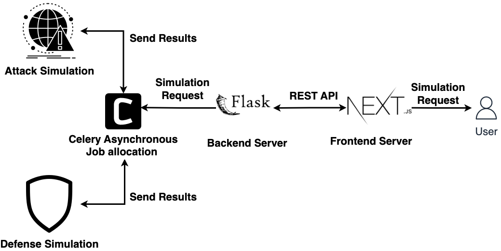

# Purple_model


## Introduction


This is a web application for image processing. It is based on Flask and Celery. The backend is written in Python and the frontend is written in Next.js.

The main goal of this project is to demonstrate the model poisoning attack and defense. The attack is based on the paper [](). The defense is based on the paper [Defending Against Model Poisoning Attacks]().

## Build with
- 
- 
- 
### How to use

1. Install the required packages

```bash
pip install pipenv
pipenv install
```
2. Run the virtual environment

```bash
pipenv shell
```
3. Run celery

```bash
cd web/backend
celery -A app.celery worker --loglevel=info
```

4. Run the web
```bash
python3 ./web/backend/app.py
```

5. Run the frontend (http://localhost:3000)
```bash
cd web/frontend
npm run dev
```

### How to install extra packages

```bash
pipenv install <package_name>
```

Todo:
### Web
- [x] original image preview
- [x] progress bar (discuss)
- [x] Pipline intergration (attack)
- [x] Pipline intergration (defense)
- [x] Pipline celery get task.info
- [x] backend send image to frontend